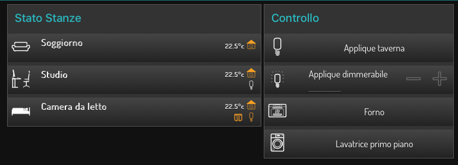

# node-red-contrib-ui-visu-ultimate
 Node-RED UI widget set, specific for home automation and compatible with knx-ultimate node.

 

<details><summary>Sample Flow</summary>
```
[{"id":"acc3bef0.8f645","type":"ui_ui-visuultimateswitch","z":"9c6f1052.3730b8","server":"f52e105f.720858","group":"b5fb6823.1a4258","order":3,"width":0,"height":0,"name":"Applique taverna","iconOn":"light_light","control":"0/1/2","controlPERCENT":"","status":"","statusPERCENT":"","x":510,"y":440,"wires":[[]]},{"id":"5049f919.61f1d8","type":"ui_ui-visuultimateswitch","z":"9c6f1052.3730b8","server":"f52e105f.720858","group":"b5fb6823.1a4258","order":4,"width":0,"height":0,"name":"Applique dimmerabile","iconOn":"light_light_dim_00","control":"0/0/11","controlPERCENT":"0/0/1","status":"","statusPERCENT":"","x":510,"y":480,"wires":[[]]},{"id":"af51840d.a82d08","type":"ui_ui-visuultimateswitch","z":"9c6f1052.3730b8","server":"f52e105f.720858","group":"b5fb6823.1a4258","order":5,"width":0,"height":0,"name":"Forno","iconOn":"scene_baking_oven","control":"3/0/1","controlPERCENT":"","status":"","statusPERCENT":"","x":460,"y":520,"wires":[[]]},{"id":"cc90f710.36a038","type":"ui_ui-visuultimateswitch","z":"9c6f1052.3730b8","server":"f52e105f.720858","group":"b5fb6823.1a4258","order":6,"width":0,"height":0,"name":"Lavatrice primo piano","iconOn":"scene_washing_machine","control":"3/0/3","controlPERCENT":"","status":"","statusPERCENT":"","x":510,"y":560,"wires":[[]]},{"id":"d90d0539.0f038","type":"ui_ui-visuultimateroomstatus","z":"9c6f1052.3730b8","server":"f52e105f.720858","group":"a582ae29.5deba","order":1,"width":"0","height":"0","name":"Soggiorno","iconOn":"scene_living","rules":[{"PositionInTemplate":"up","TopicField":"1/0/9, ","RegoleIcona":"{\"val\":\"*\",\"text\":\"@°c\",\"col\":\"0\"}"},{"PositionInTemplate":"up","TopicField":"0/0/1, 0/0/21, ","RegoleIcona":"{\"val\":false,\"icon\":\"control_all_on_off\",\"col\":\"0\"}, {\"val\":true,\"icon\":\"control_all_on_off\",\"col\":\"1\"}"}],"x":390,"y":300,"wires":[["4118e0c1.d7bdb8"]]},{"id":"7dc001ee.cbb0c","type":"function","z":"9c6f1052.3730b8","name":"","func":"msg.topic=\"1/0/10\";\n\nreturn msg;","outputs":1,"noerr":0,"x":230,"y":220,"wires":[["d90d0539.0f038","8356561d.ce6758","a7d404a7.1de55"]]},{"id":"114fd9b.75f21a6","type":"inject","z":"9c6f1052.3730b8","name":"","topic":"","payload":"true","payloadType":"bool","repeat":"","crontab":"","once":true,"onceDelay":"5","x":90,"y":200,"wires":[["7dc001ee.cbb0c"]]},{"id":"4118e0c1.d7bdb8","type":"debug","z":"9c6f1052.3730b8","name":"","active":true,"tosidebar":true,"console":false,"tostatus":false,"complete":"true","targetType":"full","x":450,"y":180,"wires":[]},{"id":"b24b8bbe.da31f","type":"inject","z":"9c6f1052.3730b8","name":"","topic":"","payload":"false","payloadType":"bool","repeat":"","crontab":"","once":false,"onceDelay":0.1,"x":90,"y":240,"wires":[["7dc001ee.cbb0c"]]},{"id":"71042927.51b7f","type":"function","z":"9c6f1052.3730b8","name":"","func":"msg.topic=\"1/0/9\";\n\nreturn msg;","outputs":1,"noerr":0,"x":250,"y":600,"wires":[["d90d0539.0f038","8356561d.ce6758","a7d404a7.1de55"]]},{"id":"7bdea01f.d4b3e8","type":"inject","z":"9c6f1052.3730b8","name":"","topic":"","payload":"22.5","payloadType":"num","repeat":"","crontab":"","once":true,"onceDelay":"2","x":90,"y":600,"wires":[["71042927.51b7f"]]},{"id":"4c0113e4.575064","type":"function","z":"9c6f1052.3730b8","name":"","func":"msg.topic=\"1/0/11\";\n\nreturn msg;","outputs":1,"noerr":0,"x":230,"y":300,"wires":[["d90d0539.0f038","8356561d.ce6758","a7d404a7.1de55"]]},{"id":"267728d9.e111c8","type":"inject","z":"9c6f1052.3730b8","name":"","topic":"","payload":"true","payloadType":"bool","repeat":"","crontab":"","once":true,"onceDelay":"8","x":90,"y":280,"wires":[["4c0113e4.575064"]]},{"id":"6660e3bf.da5c9c","type":"inject","z":"9c6f1052.3730b8","name":"","topic":"","payload":"false","payloadType":"bool","repeat":"","crontab":"","once":false,"onceDelay":0.1,"x":90,"y":320,"wires":[["4c0113e4.575064"]]},{"id":"96b666c6.f03e88","type":"function","z":"9c6f1052.3730b8","name":"","func":"msg.topic=\"0/0/21\";\n\nreturn msg;","outputs":1,"noerr":0,"x":230,"y":420,"wires":[["d90d0539.0f038","8356561d.ce6758","a7d404a7.1de55"]]},{"id":"69711f2d.477888","type":"inject","z":"9c6f1052.3730b8","name":"","topic":"","payload":"true","payloadType":"bool","repeat":"","crontab":"","once":true,"onceDelay":"10","x":90,"y":400,"wires":[["96b666c6.f03e88"]]},{"id":"705dad53.737ed4","type":"inject","z":"9c6f1052.3730b8","name":"","topic":"","payload":"false","payloadType":"bool","repeat":"","crontab":"","once":false,"onceDelay":0.1,"x":90,"y":440,"wires":[["96b666c6.f03e88"]]},{"id":"eead78b2.f7b9","type":"function","z":"9c6f1052.3730b8","name":"","func":"msg.topic=\"0/0/1\";\n\nreturn msg;","outputs":1,"noerr":0,"x":230,"y":500,"wires":[["d90d0539.0f038","8356561d.ce6758","a7d404a7.1de55"]]},{"id":"3b14904b.1a3b18","type":"inject","z":"9c6f1052.3730b8","name":"","topic":"","payload":"true","payloadType":"bool","repeat":"","crontab":"","once":true,"onceDelay":"12","x":90,"y":480,"wires":[["eead78b2.f7b9"]]},{"id":"e0adf963.71a168","type":"inject","z":"9c6f1052.3730b8","name":"","topic":"","payload":"false","payloadType":"bool","repeat":"","crontab":"","once":false,"onceDelay":0.1,"x":90,"y":520,"wires":[["eead78b2.f7b9"]]},{"id":"8356561d.ce6758","type":"ui_ui-visuultimateroomstatus","z":"9c6f1052.3730b8","server":"f52e105f.720858","group":"a582ae29.5deba","order":2,"width":"8","height":"1","name":"Studio","iconOn":"scene_office","rules":[{"PositionInTemplate":"up","TopicField":"1/0/9, ","RegoleIcona":"{\"val\":\"*\",\"text\":\"@°c\",\"col\":\"0\"}"},{"PositionInTemplate":"up","TopicField":"0/0/1, 0/0/21, ","RegoleIcona":"{\"val\":false,\"icon\":\"control_all_on_off\",\"col\":\"0\"}, {\"val\":true,\"icon\":\"control_all_on_off\",\"col\":\"1\"}"},{"PositionInTemplate":"down","TopicField":"0/0/1, 0/0/21, ","RegoleIcona":"{\"val\":false,\"icon\":\"light_light\",\"col\":\"1\"}, {\"val\":true,\"icon\":\"light_light\",\"col\":\"0\"}"}],"x":370,"y":340,"wires":[[]]},{"id":"a7d404a7.1de55","type":"ui_ui-visuultimateroomstatus","z":"9c6f1052.3730b8","server":"f52e105f.720858","group":"a582ae29.5deba","order":2,"width":"8","height":"1","name":"Camera da letto","iconOn":"scene_sleeping_alternat","rules":[{"PositionInTemplate":"up","TopicField":"1/0/9, ","RegoleIcona":"{\"val\":\"*\",\"text\":\"@°c\",\"col\":\"0\"}"},{"PositionInTemplate":"up","TopicField":"0/0/1, 0/0/21, ","RegoleIcona":"{\"val\":false,\"icon\":\"control_all_on_off\",\"col\":\"0\"}, {\"val\":true,\"icon\":\"control_all_on_off\",\"col\":\"1\"}"},{"PositionInTemplate":"down","TopicField":"1/0/10","RegoleIcona":"{\"val\":false,\"icon\":\"fts_window_2w_open_lr\",\"col\":\"0\"}, {\"val\":true,\"icon\":\"fts_window_2w_open_lr\",\"col\":\"1\"}"},{"PositionInTemplate":"down","TopicField":"1/0/11","RegoleIcona":"{\"val\":false,\"icon\":\"light_light\",\"col\":\"0\"}, {\"val\":true,\"icon\":\"light_light\",\"col\":\"1\"}"}],"x":540,"y":340,"wires":[[]]},{"id":"f52e105f.720858","type":"visu-config","z":"","name":"Config"},{"id":"b5fb6823.1a4258","type":"ui_group","z":"","name":"Controllo","tab":"9727e760.b5a91","order":2,"disp":true,"width":"6","collapse":false},{"id":"a582ae29.5deba","type":"ui_group","z":"","name":"Stato Stanze","tab":"9727e760.b5a91","order":1,"disp":true,"width":"8","collapse":false},{"id":"9727e760.b5a91","type":"ui_tab","z":"","name":"Home","icon":"dashboard","disabled":false,"hidden":false}]
```
</details>

 ## SWITCH

 **Input messages**

 <code>msg.topic</code> sets the topic<br/>
 <code>msg.payload</code> sets the value<br/>

 ## ROOM STATUS
 
 **Configuration**

<code>Config</code> sets the common configuration node, for setting the common Style, etc..<br/>
<code>Room name</code> sets the name of the room, apperaing on the widget<br/>
<code>Room icon</code> sets the icon of the room. Begin by typing the name of the icon and the corresponding list appear. Then select the preferred icon. You can view a list of all icons with names, by clicking the pink link.<br/><br/>
<code>SIGNALLING ICONS AND VALUES</code> this is a list of signalling icons, you can add on upper and lower row of the room widget. The first row represents the **far right icon**, going from right to left on wach row. The second row is the second icon from the right, and so on...<br/>
> **first field**: select the upper/lower row<br/>
> **second field**: on the second field, select one or more topic to evaluate. You can use a single topic or multiple topics, separated by comma. The widget will the evaluate all topics in "OR", that means that at least one topic must have the desired value to trigger the rule of the next field<br/>
> **third field**: this is the rule field. You can specify here what to do whenever the widget receives a value from the topic/topics. The field is automatically filled but you can then change it.<br/>
> The **third field** accepts a JSON format string based on:<br/>
> ***val*** is the value, for example true, false, 10, "hello" or whathever value you want, to wait for. You can use the wildcard char "*" to always trigger the rule. See example below.<br/>
> ***icon*** is the icon to set if the value above is received. Alternatively, you can use **text** to set a specified text. See below the example.<br/>
> ***col*** is the icon color. You can set 0 to the default color, 1 for the highlighted color or any color you specify in the HTML format, for example #ffff<br/> 
> <br/>
> **TO SET AN ICON BASED ON RECEIVED BOOLEAN VALUE**<br/>
> The format is: {"val":true,"icon":"light_light","col":"1"}<br/>
> <br/>
> **TO SET A TEXT BASED ON WILDCHAR CHARACTER**<br/>
> The format is: {"val":"\*","text":"Temperature: @ °c","col":"0"}<br/>
> ***text*** represents the text to be written. The ***@*** symbol represents the received value. In this case, if the value is 21.5, the wirget will show *Temperature: 21.5 °c*<br/>
> <br/>
> **MULTIPLE VALUES EVALUATION**<br/>
> You can evaluate more thatn one value at once, just separate each evaluation with a **comma**<br/>
> Example: {"val":false,"icon":"light_light","col":"0"},{"val":true,"icon":"light_light","col":"1"}<br/>
> Example: {"val":"switchOn","icon":"light_light","col":"0"},{"val":"SwitchOff","icon":"light_light","col":"1"}<br/>
> Example: {"val":1,"icon":"ventilator_1","col":"1"},{"val":2,"icon":"ventilator_2","col":"1"},{"val":3,"icon":"ventilator_3","col":"1"}<br/>
> Example (in this case, **no icon is displayed** if "0"): {"val":0,"icon":"","col":"0"},{"val":1,"icon":"light_light","col":"1"}<br/>
> Example (in this case, **no text is displayed** if "0"): {"val":0,"text":"","col":"0"},{"val":1,"text":"The pump is on","col":"1"}<br/>
> Example (mixing **icons and text**): {"val":0,"icon":"light_off","col":"0"},{"val":1,"icon":"light_on","col":"0"},{"val":3,"text":"The Main Power is off!","col":"1"}<br/>

 **Input messages**

 <code>msg.topic</code> sets the topic<br/> 
 <code>msg.payload</code> sets the value<br/>